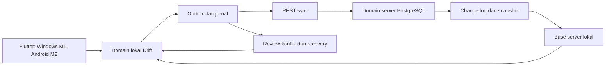
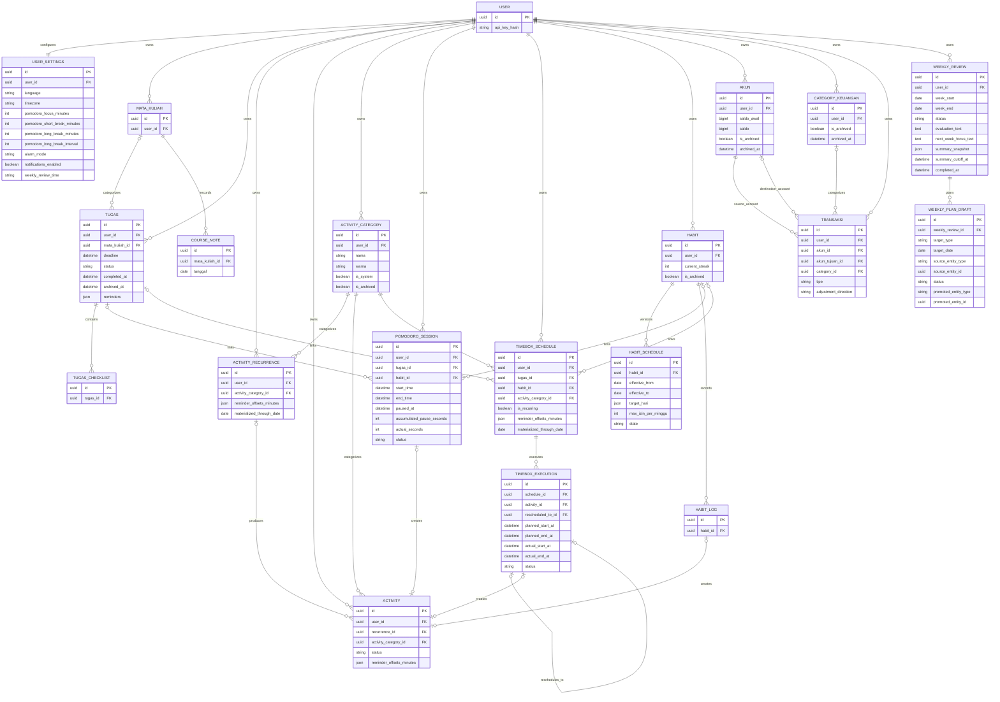
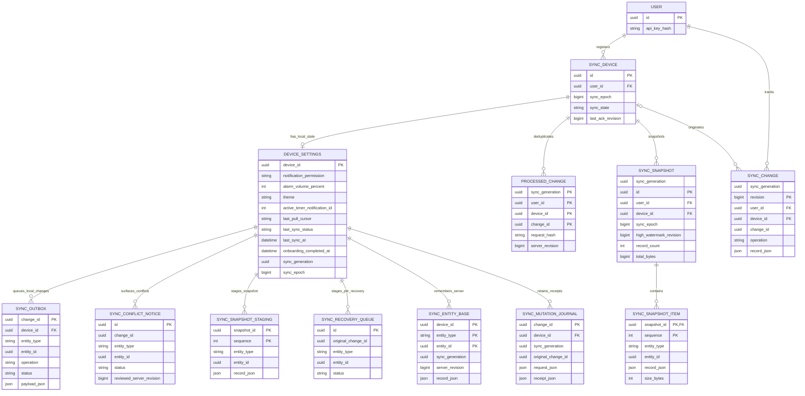

# Dailys ERD

**Versi:** 1.0 target contract  
**Terakhir diperbarui:** 6 September 2026  
**Sumber detail:** `schema.md`  
**Indeks:** `README.md`

ERD ini menunjukkan hubungan antar-entity. Field, tipe data, constraint, index,
aturan sync, dan migrasi tetap didefinisikan oleh `schema.md`.

## 1. Gambaran umum

Panah pada gambaran umum menunjukkan aliran data. Relasi ERD berikut menunjukkan
ownership/FK; field rinci tetap berada di schema. Baseline belum diimplementasikan.

## 2. Relasi domain

## 3. Infrastruktur sync

DEVICE_SETTINGS, SYNC_OUTBOX, SYNC_CONFLICT_NOTICE, SYNC_SNAPSHOT_STAGING,
SYNC_RECOVERY_QUEUE, SYNC_ENTITY_BASE, dan SYNC_MUTATION_JOURNAL bersifat local-only.
Relasi ke device menjelaskan ownership lokal; tabel tersebut tidak berada di server.
USER_SETTINGS termasuk domain yang disinkronkan. Snapshot item adalah materialisasi
server sementara, sedangkan jurnal lokal mempertahankan receipt setelah outbox selesai.

sync_generation berasal dari konfigurasi deployment di luar database restore;
ia bukan entity tambahan. Schema memuat 32 entity/table v1.0. Conflict review
menahan edit lokal pada record terkait; ia tidak menahan lock database server
selama pengguna memilih.
